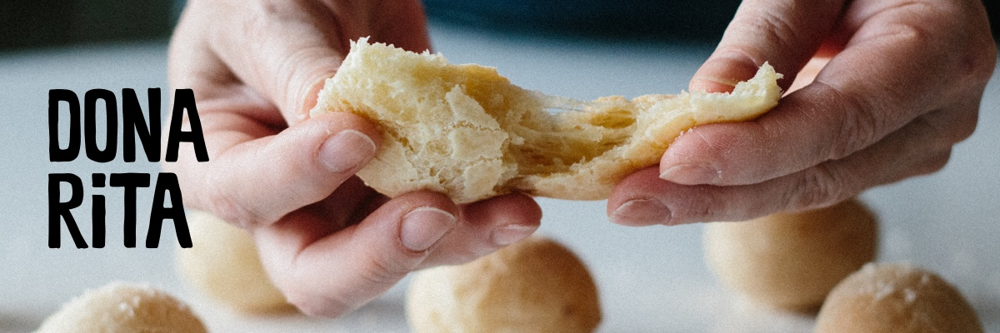
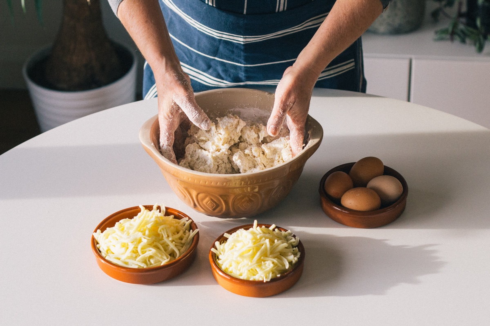

### Pão de Queijo
A proper Pão de Queijo (cheese bread) is a two-bite business: crunchy on the outside and fluffy on the inside. Made with cassava flour and fresh cheese, it’s a farmer's take on traditional European bread - without the wheat. Pão de Queijo is a staple snack at most cafes, restaurants and dinner parties across Brazil. It’s cheesily addictive and naturally gluten free.

Try pairing it with a short black coffee Sao Paulo style, or spread thickly with guava jam* for a sweet contrast.

### Rita's saudade*
When Rita left the tropics for Norwich she missed Pão de Queijo so much she started baking it from scratch. For the last 15 years she’s been perfecting her secret family recipe. Now her little cheese bread is so delicious, some people think it's better than the original. We can't wait for you to try it.

### Contact
Call us on {{ site.phone }} 
Email us on [{{ site.email }}](mailto:{{ site.email }})
